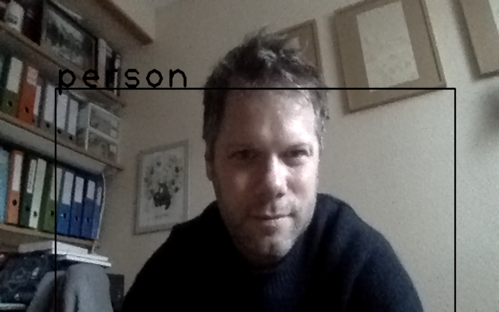

Origami-based application using Bazel compilation
----------------------

This project demonstrates the usage of Origami via Bazel compilation. The origami dependencies are retrieved from a custom Maven repositories.

To build this example, you will need to [install
Bazel](http://bazel.io/docs/install.html).

This repository demonstrates the usage of bazel's 
[`rules_jvm_external`](https://github.com/bazelbuild/rules_jvm_external/) to
configure dependencies. The dependencies themselves are configured in the `WORKSPACE` file.

Build the main application by running:

```
$ bazel build :origami-check
```

Test the code by running:

```
$ bazel test :tests
```

Finally, run the application by running

```
$ ./bazel-bin/origami-check
```

# Other demo applications

- *origami-check*: load and display a mat
- *origami-webcam*: run the webcam
- *origami-greycam*: run the webcam with an extra origami filter to turn the stream to grey 
- *origami-cartooncam*: run the webcam with an extra origami filter to cartoonify the stream
- *origami-yolocam*: run the webcam with yolo detection
- *origami-agenet*: run DNN agenet to find age of input picture

# yolo proof



# build or test all 

## the old way 

```
# https://github.com/bazelbuild/bazel/issues/4257
# build all
$ bazel build $(bazel query //...)
# test all
$ bazel test $(bazel query //...) 
```

## the new way 

```
$ bazel clean
$ bazel build //...
$ bazel test //...
```

# when bazel looks broken

```
sudo xcode-select -s /Applications/Xcode.app/Contents/Developer
sudo xcodebuild -license accept
bazel clean --expunge
```